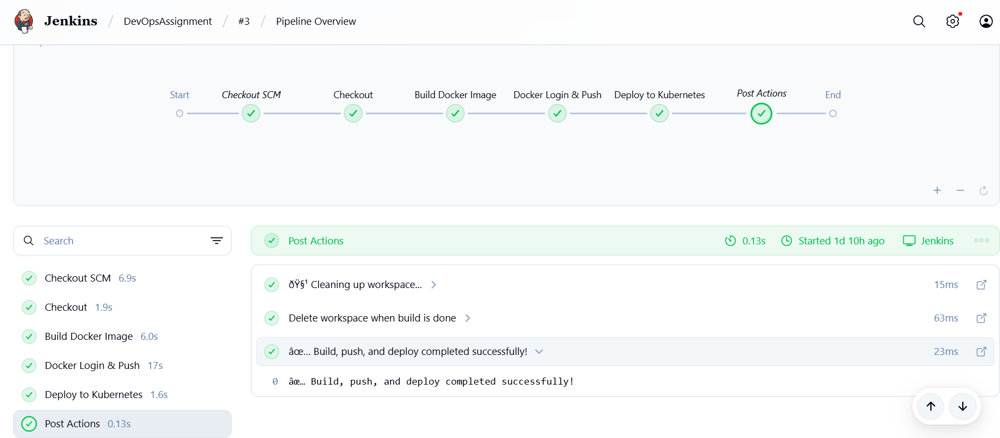
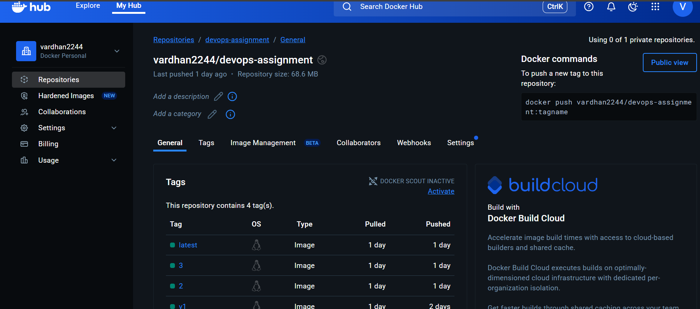
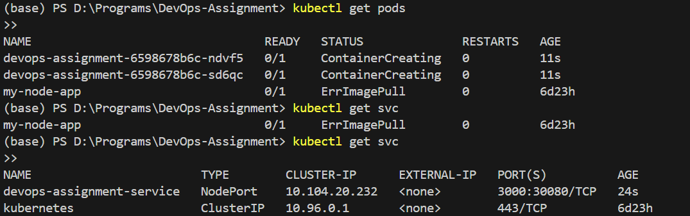
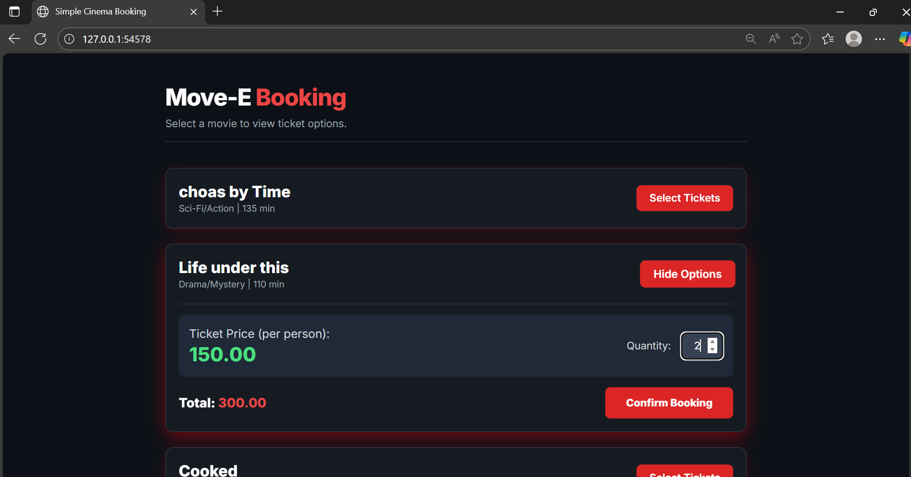

<!-- README for DevOps-Assignment-2 -->


# 🚀 DevOps Assignment II – Node.js Application Deployment

Simple **Node.js** *Movie Ticket booking 🎬* web app deployed with **Docker** and **Kubernetes** using a **Jenkins CI/CD Pipeline**.

---

## 📘 Overview
This project demonstrates a complete CI/CD pipeline for a Node.js application. It uses Jenkins to automate build, test, containerization (Docker) and deployment to a local Kubernetes (Minikube) cluster.

---

## 🧰 Tech stack

- Node.js
- Git & GitHub
- Docker
- Jenkins
- Kubernetes (Minikube)
- Docker Hub

---

## 🏗️ Project structure

```
DevOps-Assignment-2/
│
├── app/                # Node.js application source (if present)
│   ├── package.json
│   └── server.js
│
├── k8s/                # Kubernetes manifests
│   ├── deployment.yaml
│   └── service.yaml
│
├── Dockerfile
├── Jenkinsfile
├── .dockerignore
├── .gitignore
└── README.md
```

Important files (where to look):

- `server.js` — Node.js application entrypoint
- `package.json` — dependencies & scripts
- `Dockerfile` — image build definition
- `index.html` — static frontend (if used by the app)
- `k8s/deployment.yaml` — Kubernetes Deployment manifest
- `k8s/service.yaml` — Kubernetes Service manifest
- `Jenkinsfile` — pipeline definition
- `my-kubeconfig.yaml` — example kubeconfig (do not commit secrets)

---

## ⚙️ Prerequisites

Before running the pipeline or testing manually, make sure you have the following installed and configured. Commands below are for Windows PowerShell (you can adapt them for macOS/Linux):

- Python 3.10+ (optional): some utility scripts may require Python. Download from https://www.python.org/downloads/.

	```powershell
	python --version
	```

- Node.js (LTS) and npm: the application is a Node.js app.

	```powershell
	# install from https://nodejs.org/en/ (LTS recommended)
	node --version
	npm --version
	```

- Docker (Docker Desktop recommended): used to build and run container images.

	```powershell
	docker --version
	```

	- On Windows, install Docker Desktop and enable required features (WSL2 backend is recommended).

- kubectl (Kubernetes CLI): required to apply manifests to a cluster.

	```powershell
	kubectl version --client --short
	```

	- Install: follow the official guide https://kubernetes.io/docs/tasks/tools/ or use Chocolatey: `choco install kubernetes-cli` (if using Chocolatey).

- Minikube (for local Kubernetes testing): to run a single-node Kubernetes cluster locally.

	```powershell
	minikube start
	minikube status
	```

	- Install: https://minikube.sigs.k8s.io/docs/start/

- Jenkins: CI/CD server to run the `Jenkinsfile` pipeline.

	```powershell
	# Jenkins is typically accessed via the web UI after installation
	# Default URL: http://localhost:8080
	```

	- Install: https://www.jenkins.io/download/

- Git: version control and to clone the repository.

	```powershell
	git --version
	```

- Docker Hub account (or another container registry): used by the pipeline to push images. Store credentials securely in Jenkins credentials.

Notes:

- On Windows, prefer installing tools via official installers or a package manager you trust (Chocolatey, Scoop, or Winget).
- Ensure `kubectl` is configured to talk to your cluster (for Minikube: `minikube start` sets context automatically).
- If you plan to use Minikube's Docker daemon (so the cluster can use locally-built images), run `minikube docker-env` and follow the instructions to configure your shell before `docker build`.

---

## 🔁 Jenkins CI/CD pipeline (high level)

The `Jenkinsfile` in this repo defines a multi-stage pipeline. Typical stages:

1. Checkout code
2. Build Docker image
3. Docker login & push (to Docker Hub)
4. Deploy to Kubernetes (apply `k8s/` manifests)

Pipeline notes:

- Image tags are typically per-build (e.g. `vardhan2244/devops-assignment:${BUILD_NUMBER}`) and `:latest`.
- Credentials (Docker Hub username/token and kubeconfig) must be configured in Jenkins credentials store.

### Jenkins credentials example

The pipeline expects two credentials (configure them in Jenkins → Manage Jenkins → Credentials):

- `fe08e1ad-3815-4480-81d2-f82cd7d17542` — Username & Password (Docker Hub username and token)
- `Kube-cred` — Secret file or text containing kubeconfig for the cluster (or configure access another secure way)

Adjust the credential IDs and method to your Jenkins setup.

---

## 🐋 Docker — manual build & test

Build and run locally to verify the app before pushing to a registry.

```powershell
# from repo root
npm install

# build image (replace with your Docker Hub username)
docker build -t vardhan2244/devops-assignment:v1 .

# run container locally
docker run -p 3000:3000 vardhan2244/devops-assignment:v1

# open http://localhost:3000
```

Push to Docker Hub (manual step before deploying to an external Kubernetes cluster):

```powershell
docker push vardhan2244/devops-assignment:v1
docker tag vardhan2244/devops-assignment:v1 vardhan2244/devops-assignment:latest
docker push vardhan2244/devops-assignment:latest
```

---

## ☸️ Kubernetes deployment (Minikube / local testing)

If you're using Minikube you can either push the image to Docker Hub (recommended for shared clusters) or use Minikube's Docker daemon so the cluster can use local images.

1) Apply manifests to the cluster:

```powershell
kubectl apply -f k8s/deployment.yaml
kubectl apply -f k8s/service.yaml

kubectl get pods
kubectl get svc
```

2) Expose / access the service via Minikube:

```powershell
minikube service devops-assignment-svc --url
```

Open the printed URL in your browser to access the app.

Notes:

- Ensure the image referenced in `k8s/deployment.yaml` is accessible to the cluster (use Docker Hub or minikube's docker-env workflow).
- If using Minikube's docker daemon you can do:

```powershell
minikube docker-env; # follow minikube's guidance to use its docker daemon in your shell
docker build -t vardhan2244/devops-assignment:latest .
kubectl apply -f k8s/deployment.yaml
```

---

---
## 📸 Screenshots

### 1. Jenkins Pipeline Success


### 2. Docker Hub Image Repository


### 3. Kubernetes Deployment Status

### 4. Live Application


---

## 🔐 Security & best practices

- Do not commit real kubeconfigs, passwords, or tokens in the repo. Use Jenkins credentials or a secret manager.
- For production workflows use a private registry or proper image promotion strategy and immutable image tags.
- Use readiness and liveness probes in your deployment manifests (consider adding them to `k8s/deployment.yaml`).

---

## 📦 Useful commands (summary)

```powershell
# npm install
npm install

# run locally
node server.js

# docker build & run
docker build -t vardhan2244/devops-assignment:latest .
docker run -p 3000:3000 vardhan2244/devops-assignment:latest

# kubernetes
kubectl apply -f k8s/deployment.yaml
kubectl apply -f k8s/service.yaml
kubectl get pods,svc
minikube service devops-assignment-svc --url
```

---

## 🔗 Links

- GitHub: https://github.com/Vardhan248/DevOps-Assignment-2
- Docker Hub: https://hub.docker.com/r/vardhan2244/devops-assignment

---

## 🏁 Conclusion

This repository demonstrates a full automated CI/CD flow using Jenkins, Docker and Kubernetes for a Node.js app. The `Jenkinsfile` implements build, push and deploy stages; the `k8s/` manifests declare the cluster resources.